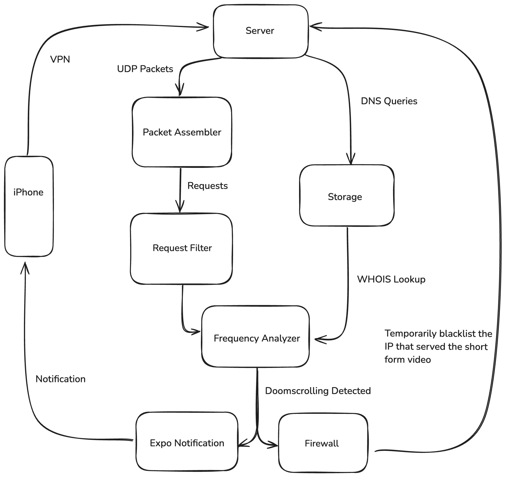

# Stop Being Cooked

StopBeingCooked is a system that blocks Instagram Reels and other Short Form Video content, it works on any device with theoretically any app.

## The Setup
Create a VPN Server on a Linux device using [wireguard-install](https://github.com/angristan/wireguard-install).

Install the wiregurad-vpn app on your client device and connect to the server.

Clone this repo, then run 
```
pipenv install
```

## Running the app 
An admin password will be requested
```
./run.sh
```

This assumes that:
1. You're on a Linux system that has iptables control
2. Your default interface is called `br0` as set in `interceptor.py`
3. There is only 1 concurrent device connected to the VPN server

## How does it work 



StopBeingCooked works by cross-analyzing UDP packets with DNS WHOIS lookups. To be able to do so a VPN connection must be established between the device and a Linux server, giving the latter access to the raw network packets.

A local approach on iOS with the NetworkExtension was attempted, but discarded due to the complexity and no guarantee that such app would be approved on the App Store.


## Components
`interceptor.py`    taps into the network traffic with scapy, saves DNS queries and aggregates UDP packets into requests

`detector.py`       analyzes UDP requests and DNS queries to decide whether a user is doomscrolling

`notifications.py`  sends a notification to the device via expo notifications

`firewall.py`       handles the temporary blacklisting of incoming packets using iptables

`whois.py`          reverse DNS lookup based on past data

`deploy.py`         deployment script for all the necessary components

## Firewall Recovery 

In case the program ends abruptly while a firewall blocking rule is present you may use the following procedure to reverse it.

### Listing all rules
```
sudo iptables -S FORWARD
```

### Deleting rule 
```
sudo iptables -D FORWARD -s 76.10.130.224/32 -j DROP
```